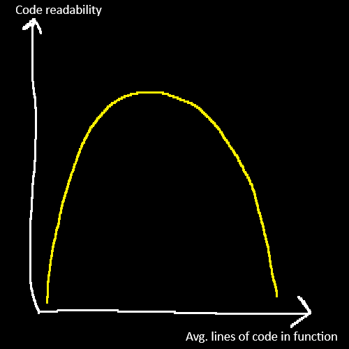

SOLID is a set of 5 software design principles that intends to make code more understandable and maintainable.

SOLID is a mnemonic acronym:
- Single-Responsibility Principle
- Open-Close Principle
- Liskov Substitution Principle
- Interface Segregation Principle
- Dependency Inversion Principle

***

SOLID principles originally were published in paper [Design Principles and Design Pattern](https://staff.cs.utu.fi/~jounsmed/doos_06/material/DesignPrinciplesAndPatterns.pdf) by Robert C. Martin (Uncle Bob).

::: {.fragment}
Robert C. Martin is an author of several other courses and books. Some of the most famous of which are Clean Code series. Ideas in clean code series, just like in SOLID, are reasonable when looked at from the high level perspective. However they have a danger to be overused and backfire.
:::

***

Function with 1000 lines of code is hard to understand, because there are lots things happening in it, and just the sheer amount of code causes high mental load because you need to think about it as a single unit (single function). But the same applies to a class with 100s of 3 line long methods, where the single method might be more obvious to understand in isolation, but the amount of indirection happening makes the mental load unbearable as well.

***



***

Like the example with Single-Responsibility Principle in the section, it is possible to go overboard when trying to principles and output even less legible code, than before applying the principles that are supposed to help.

*P.S. the examples next are supposed to illustrate the SOLID principles and not the perfect code.*

::: {.notes}
Additional reading:
- Ideas on how to reason about principles like SOLID: https://softwareengineering.stackexchange.com/a/447543/264283.
- Critique on Clean Code and how misusing the principles can have the opposite effect: https://qntm.org/clean.
:::

## Single-Responsibility Principle

>A class should only have one reason to change

If a class has more than one responsibility, then the responsibilities become coupled. Changes to one responsibility may break the class’ ability to fulfil other responsibilities.

This can apply to:
- Methods
- Classes
- Modules
- Etc.

***

```{.csharp}
// Bad example - what are the readons to change?

using System.Text.Json;
using System.IO;

class NameRegistry
{
    private string _title;
    private string _firstName;
    private string _lastName;

    public void EnterTitle()
    {
        Console.WriteLine("Enter title:");
        _title = Console.ReadLine();
    }

    public void EnterFirstName()
    {
        Console.WriteLine("Enter first name:");
        _firstName = Console.ReadLine();
    }

    public void EnterLastName()
    {
        Console.WriteLine("Enter last name:");
        _lastName = Console.ReadLine();
    }

    public void Save()
    {
        var name = new { Name = $"{_title} {_firstName} {_lastName}" };
        File.WriteAllText("name.txt", JsonSerializer.Serialize(name));
    }
}
```

***

Possible reasons to change for the `NameRegistry` class:
- Name parts should come from different source than `Console`.
- Name should be assembled into different format.
- Name should be serialized to different format than JSON.
- Should be persisted not in file, but somewhere else.

***

```{.csharp}
interface INameSupplier
{
    string GetTitle();
    string GetFirstName();
    string GetLastName();
}

interface INameRepository
{
    void Save(string value);
}

interface INameFormatter
{
    string Format(string title, string firstName, string lastName);
}

interface INameSerializer
{
    string Serialize(string name);
}

class NameRegistry
{
    private string _title;
    private string _firstName;
    private string _lastName;

    private readonly INameSupplier _nameSupplier;
    private readonly INameRepository _nameRepository;
    private readonly INameSerializer _nameSerializer;
    private readonly INameFormatter _nameFormatter;

    private NameRegistry(
        INameSupplier nameSupplier, 
        INameSerializer nameSerializer, 
        INameRepository nameRepository,
        INameFormatter nameFormatter)
    {
        _nameSupplier = nameSupplier;
        _nameSerializer = nameSerializer;
        _nameRepository = nameRepository;
        _nameFormatter = nameFormatter;
    }

    public void EnterTitle()
    {
        _title = _nameSupplier.GetTitle();
    }

    public void EnterFirstName()
    {
        _firstName = _nameSupplier.GetFirstName();
    }

    public void EnterLastName()
    {
        _lastName = _nameSupplier.GetLastName();
    }
    
    public void Save()
    {
        var formatted = _nameFormatter.Format(_title, _firstName, _lastName);
        var serialized = _nameSerializer.Serialize(formatted);
        _nameRepository.Save(serialized);
    }
}
```

## Open-Close Principle

> You should be able to extend a classes behavior, without modifying it.

::: {.fragment}
If you need to add new behaviour to a class, you should not need to go and modify that class. This most prominently applies to "one more" type of problems. I.e. when we have a few types of customers, but now we need to start supporting additional type of customer.
:::

***

```{.csharp}
// Bad example
// If a new customer type would be added, this would imply that you need to go and modify this class to support it.

class Customer
{
    public int Type { get; set; }

    public Customer(int type)
    {
        Type = type;
    }

    public double GetDiscountRate()
    {
        if (Type == 1)
        {
            return 0.1;
        }
        else if (Type == 2)
        {
            return 0.2;
        }
        else
        {
            return 0;
        }
    }
}
```

***

```{.csharp}
// An approach in spirit of Open/Closed principle

class Customer
{
    public virtual double GetDiscountRate()
    {
        return 0;
    }
}

class SilverCustomer : Customer
{
    public override double GetDiscountRate()
    {
        return 0.1;
    }
}

class GoldCustomer : Customer
{
    public override double GetDiscountRate()
    {
        return 0.2;
    }
}
```

***

In this example if the behaviour is tied to the customer, and there is a class `Customer` which represents it, it is produces better code by moving all the corresponding behaviour to a subclass. In such case a new instance of appropriate sub-class of customer would have to be created and then passed forward to other classes, but this would prevent need to modify the same `Customer` class or other users of this class.

***

```{.csharp}
// Another bad example
// For every new shape that would be added, the AreaCalculator class would need to be modified.

class Rectangle
{
    public double Width { get; set; }
    public double Height { get; set; }
}

class Circle
{
    public double Radius { get; set; }
}

class AreaCalculator
{
    public double CalculateArea(object shape)
    {
        if (shape is Rectangle)
        {
            var rectangle = (Rectangle)shape;
            return rectangle.Width * rectangle.Height;
        }
        else if (shape is Circle)
        {
            var circle = (Circle)shape;
            return circle.Radius * circle.Radius * Math.PI;
        }
        else
        {
            throw new ArgumentException();
        }
    }
}
```

***

```{.csharp}
// A better approach
class Shape
{
    public virtual double Area()
    {
        return 0;
    }
}

class Rectangle : Shape
{
    public double Width { get; set; }
    public double Height { get; set; }

    public override double Area()
    {
        return Width * Height;
    }
}

class Circle : Shape
{
    public double Radius { get; set; }

    public override double Area()
    {
        return Radius * Radius * Math.PI;
    }
}

class AreaCalculator
{
    public double CalculateArea(Shape shape)
    {
        return shape.Area();
    }
}
```

## Liskov Substitution Principle

> Objects in a program should be replaceable with instances of their subtypes without altering the correctness of that program.

::: {.fragment}
In other words - it should be possible to pass any subclass instead of base class, and the program should work correctly in every case. If it is no possible pass a subclass instead of the base class, then it most likely means that the subclass should not be inheriting the main class.
:::

***

LSP Checklist:
- No new exceptions should be thrown in derived class: if your base class threw `ArgumentException` then your subclasses are only allowed to throw exceptions of type `ArgumentException` or any exceptions derived from it. Throwing `IndexOutOfRangeException` is a violation of LSP.
- Pre-conditions cannot be strengthened: assume your base class works with a member `int`. Now your subtype requires that `int` to be positive. This is strengthened pre-conditions, and now any code that worked perfectly fine before with negative ints is broken.
- Post-conditions cannot be weakened: assume your base class required all connections to database to be closed before the method returned. In your subclass you overrode that method and left connection open for further reuse. 

***

```{.csharp}
// Example of LSP violation

class Rectangle
{
    public virtual double Width { get; set; }
    public virtual double Height { get; set; }
}

class Square : Rectangle
{
    private double _width;
    private double _height;

    public override double Width
    {
        get => _width;
        set
        {
            _width = value;
            _height = value;
        }
    }

    public override double Height
    {
        get => _height;
        set
        {
            _width = value;
            _height = value;
        }
    }
}

var rectangle = new Rectangle { Width = 2, Height = 3 };
var square = new Square { Width = 2, Height = 3 };

void PrintDimensions(Rectangle rectangle)
{
    Console.WriteLine($"{rectangle.Width} x {rectangle.Height}");
}

PrintDimensions(rectangle);
PrintDimensions(square);
```

## Interface Segregation Principle

> Clients should not be forced to implement interfaces they do not use.

::: {.fragment}
Fat interfaces that contain many methods should be avoided. Instead think if they can be separated by their use cases. Does every user of the interface always uses all methods or only subset of these methods.
:::

***

```{.csharp}
// Bad example

interface IPrinter
{
    void Print();
    void Scan();
    void Fax();
}

class FullyFunctionalPrinter : IPrinter
{
    public void Print()
    {
        Console.WriteLine("Printing...");
    }

    public void Scan()
    {
        Console.WriteLine("Scanning...");
    }

    public void Fax()
    {
        Console.WriteLine("Faxing...");
    }
}

class SmallPrinter : IPrinter
{
    public void Print()
    {
        Console.WriteLine("Printing...");
    }

    public void Scan()
    {
        throw new NotImplementedException();
    }

    public void Fax()
    {
        throw new NotImplementedException();
    }
}
```

***

```{.csharp}
// A better approach
interface IPrinter
{
    void Print();
}

interface IScanner
{
    void Scan();
}

interface IFax
{
    void Fax();
}

class FullyFunctionalPrinter : IPrinter, IScanner, IFax
{
    public void Print()
    {
        Console.WriteLine("Printing...");
    }

    public void Scan()
    {
        Console.WriteLine("Scanning...");
    }

    public void Fax()
    {
        Console.WriteLine("Faxing...");
    }
}

class SmallPrinter : IPrinter
{
    public void Print()
    {
        Console.WriteLine("Printing...");
    }
}
```

***

```{.csharp}
// If you want o reduce verbosity
interface IOfficeMachine
{
    void Print();
    void Scan();
    void Fax();
}
```

## Dependency Inversion Principle

>Depend on abstractions, not on concretions.

- High level modules should not depend upon low level modules. Both should depend upon abstractions.
- Abstractions should not depend upon details. Details should depend upon abstractions.

***

```{mermaid}
graph LR
    A[High-level Module] -->|depends on| B[Abstraction]
    C[Low-level Module] -->|depends on| B[Abstraction]
```

***

Ways to implement DIP:
- Dependency injection – most common way.  
- Service Locator
- Events
- Etc.

***

```{.csharp}
// No dependency inversion:

// High level class dealing with application level logic
class SalaryCalculator
{
    public double CalculateSalary(double hourlyRate, int hoursWorked)
    {
        return hourlyRate * hoursWorked;
    }

    public void SaveSalary(double salary)
    {
        var repository = new SalaryFileRepository();
        repository.SaveSalary(salary);
    }
}

// Low level class dealing with file operations
class SalaryFileRepository
{
    public void SaveSalary(double salary)
    {
        System.IO.File.WriteAllText("salary.txt", salary.ToString());
    }
}
```

***

```{.csharp}
// With dependency inversion:

// Both classes depend on this interface
interface ISalaryRepository
{
    void SaveSalary(double salary);
}

class SalaryFileRepository : ISalaryRepository
{
    public void SaveSalary(double salary)
    {
        System.IO.File.WriteAllText("salary.txt", salary.ToString());
    }
}

class SalaryCalculator
{
    private readonly ISalaryRepository _salaryRepository;

    // This class does not depend on concrete implementation
    // It rather depends on an abstraction, which can be easily replaced
    public SalaryCalculator(ISalaryRepository salaryRepository)
    {
        _salaryRepository = salaryRepository;
    }

    public double CalculateSalary(double hourlyRate, int hoursWorked)
    {
        return hourlyRate * hoursWorked;
    }

    public void SaveSalary(double salary)
    {
        _salaryRepository.SaveSalary(salary);
    }
}
```

# Other acronyms

Just like SOLID, there are a bunch of other quite popular mnemonic devices aimed at promoting writing of more readable code.

## GRASP

> General Responsibility Assignment Software Principles.

- Information expert
- Creator
- Controller
- Indirection
- Low coupling
- High cohesion
- Polymorphism
- Protected variations
- Pure fabrication

## KISS

> Keep It Simple, Stupid.

Acronym suggests not to overengineer the solutions and aim for the simpler implementation.

## DRY

> Don't repeat yourself.

If the exact same code, for the exact same purpose is in multiple places - then you are repeating yourself.

Acronym suggests to move the repetitive code into a common place and reference it from there.

## YAGNI

> You aren't gonna need it.

Don't create reusabilty and abstractions where there is no obvious need for them.

## CoC

> Conventions over Configuration.

Provide sensible default for your code which would allow it to work out of the box, instead of asking user to explicitly configure everything.
