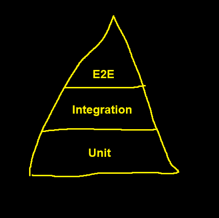
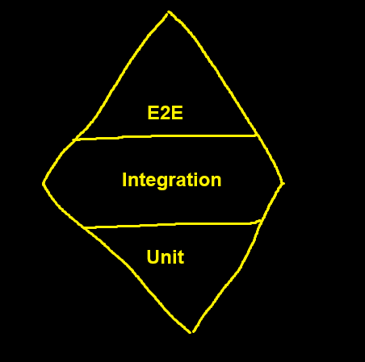

```{mermaid}
mindmap
  root((Quality assurance))
    (Testing)
      Manual testing
      Automated testing
        Unit testing
        Integration testing
        E2E testing
        ...
    (Coding standards)
      Static analysis
      Linting rules
      Style guidelines
    (Code reviews)
      Pull requests
    (Other activities)
      ...
```

::: {.content-visible unless-format="revealjs"}
Testing is a part of overall software quality assurance process. Testing is used to ensure that the developed software does what it is supposed to do by trying it out.

Software engineers usually does testing while automated test development. Automated tests take on many forms depending on the scope of what is being tested.

Automated test's scope can range from testing a single method by passing predefined inputs and expecting predefined outputs, to running a whole application, including dependencies like database, and testing that the application behaves correctly when interacted via UI.
:::

***

The most simple automated test is just a dedicated method that calls another method with predefined input, and asserts that returned results is what was expected.

```csharp
public int AddNumber(int a, int b)
{
    return a + b;
}

public void Test_AddNumber()
{
    if (AddNumber(5, 9) == 14)
    {
        Console.WriteLine("Test passed");
        return;
    }

    Console.WriteLine("Test_AddNumber failed");
}
```

***

Usually the methods you are testing are going to have more functionality and they will have to be tested against several cases:

```csharp
public double PerformMath(string expression)
{
    var parts = expression.Split(' ');
    var a = double.Parse(parts[0]);
    var b = double.Parse(parts[2]);

    switch (parts[1])
    {
        case "+":
            return a + b;
        case "-":
            return a - b;
        case "*":
            return a * b;
        case "/":
            return a / b;
        default:
            throw new ArgumentException("Invalid operator");
    }
}
```

***

Test methods:

```csharp
public void PerformMath_Addition_Works()
{
    var result = PerformMath("2 + 3");
    
    if (result != 5)
    {
        throw new Exception("Addition failed");
    }

    Console.WriteLine("Addition works");
}

public void PerformMath_Subtraction_Works()
{
    var result = PerformMath("2 - 3");
    
    if (result != -1)
    {
        throw new Exception("Subtraction failed");
    }

    Console.WriteLine("Subtraction works");
}

```

## What the automated tests should be like

Good automated tests are:
- Fast to execute.
- Predictable, meaning that there are no variations between runs.
- Easy to understand.

::: {.content-visible unless-format="revealjs"}
### Fast to run tests

Test should run relatively fast. The longer the tests are going to run, the less frequently engineers are going to run them. For a medium sized project ~1min to run the tests is reasonable. If the tests were to run longer, for let's say 10 minutes, then it is almost guaranteed that engineers would run them very rarely, maybe once before the pull request.

The less frequently the tests are ran, the less obvious benefit they bring, so the less intrinsic motivation engineers have to maintain and expand them.

Same logic applies to launching the tests. Tests should be launched with a single command. No additional commands, no additional service startups or environment preparations must be needed. The more setup tests requires, the less likely they are going to be ran because of the friction. Good tests are started with a single command and no external dependencies.

However there are some possible trade-offs when the longer running test might be tolerable if thoroughly tests a large project or many smaller services.
:::

### Test predictability

Tests must be predictable between runs. This means that if the code under testing was not changed and the test itself was not changed, then the outcome of the test must be always the same, regardless of how many times or when it was ran.

Tests that are not predictable between runs are called *brittle*.

***

```{.csharp}
int GetEpochTime()
{
    return (int)(DateTime.UtcNow - new DateTime(1970, 1, 1)).TotalSeconds;
}

void Test_GetEpochTime()
{
    int epochTime1 = GetEpochTime();
    // Imagine some delay here
    System.Threading.Thread.Sleep(100);
    int epochTime2 = GetEpochTime();

    if (epochTime2 != epochTime1)
    {
        Console.WriteLine("Test failed.");
    }
    else
    {
        Console.WriteLine("Test passed.");
    }
}

Test_GetEpochTime();
```

::: {.content-visible unless-format="revealjs"}
Tests usually become brittle if they are using some shared state or relying on some uncontrolled, global, variables.

Examples of shared state include using a live database, shared sqlite database file or a shared real implementation of some API. This means that the tests might influence each others data and the subsequent tests can run against the data leftovers of the previous test

Examples of global variables could be `DateTime.UtcNow` or similar date constructs. Because they are `static` it is difficult to mock them. On top of that they are not controllable by user, but are rather provided by the runtime. If the tests assumes that some date is always going to be future date and asserts it against some predefined date. Eventually the future will arrive and the date will become past date and the test will begin to fail. 
:::

### Measuring test coverage  

Test coverage percentage is used to find out how much of the code was "touched" by the tests during the test execution.

::: {.content-visible unless-format="revealjs"}
Coverage is calculated based on data collected while tests run. Line coverage measures the percentage of lines executed, and branch coverage checks if all paths in conditional statements are tested. These results are combined into a total percentage to show how many code tests cover.

In .NET, test coverage can be checked using Coverlet. It creates reports automatically and shows the percentage of covered code and highlights tested and untested areas.

Some parts of the code should be excluded from coverage calculation. For example, generated code, third-party libraries, trivial code like simple getters and setters, utility functions, and code related to debugging or logging. Without those parts, test coverage becomes more meaningful.  

Test coverage percentage is not a very reliable metric for software quality. High coverage shows that the code runs during tests but doesn’t prove that behavior is tested correctly. However, it is quick to implement and can be useful when combined with practices like code reviews.
:::

***

Lines covered by the tests in the previous example are prefixed with `+`.

```csharp
public double PerformMath(string expression)
{
+    var parts = expression.Split(' ');
+    var a = double.Parse(parts[0]);
+    var b = double.Parse(parts[2]);

+   switch (parts[1])
    {
+       case "+":
+            return a + b;
+       case "-":
+            return a - b;
        case "*":
            return a * b;
        case "/":
            return a / b;
        default:
            throw new ArgumentException("Invalid operator");
    }
}
```

In this example we could argue that 8 out of 14 LOC were covered by tests in the previous example so the total coverage is 8/14 ~= 57%.

## Why automated tests?

```{mermaid}
mindmap
  root(Automated testing)
    Goals of the automated testing
      Increased code quality
      Increased trust in the application
      Increased development velocity
```

::: {.content-visible unless-format="revealjs"}
Automated tested is supposed to help quickly and repeatedly reliably determine if the code is functioning as expected. This in turn should help to increase the development velocity over time. Even if it does not look worthwhile to write tests at the beginning, because writing the tests themselves takes time, it is largely accepted that writing them pays off over sufficiently long time.

The term "*sufficiently long time*" might be a bit ambiguous, so to put more concreteness into it: if you are guaranteed that some script you are writing is only going to be ran once and only by you, then it might not be worthwhile to write automated tests as testing manually might indeed be faster. However if it is some project that you will be working on for a month, it is most likely already worthwhile to write some automated tests for it.
:::

::: {.content-visible unless-format="revealjs"}
Automated tests should tell you:
1. Is the code being tested working as expected?
2. If it is not working, then point you in the direction of problems.

The 1st point is obvious, while the 2nd point has much more to it than it might appear at first. Firstly the failing test should indicate what part of code is not working so you would know what you should investigate. This can be done via test naming, custom failure exception messages or combination of both. Usually it is easier to do this via test names.

Secondly, even if by the failing test name you know the use case that is failing, it would still be nice if the test could point you even more. This can be achieved via very clean test method code. The test code must be very legible. If the test code is very clear, then it should be very easy to trace how the assertion value that failed was acquired. Knowing the exact sequence of how the failure was produced should help you finding the source of the problem.
:::

## Types of tests

```{mermaid}
mindmap
  root((Quality assurance))
    (Automated testing)
      Unit testing
      Integration testing
      E2E testing
      ...
```

::: {.content-visible unless-format="revealjs"}
### Unit tests

Unit tests are testing a single unit. The definition of unit can vary a lot, it can range from single method, to the whole assembly.

Whatever the size of unit is decided to be, such tests, by definition, needs to test that unit in isolation. Testing in isolation means, that all dependencies of that unit are substituted with fakes or mocks, and only the logic of that unit is tested.

The upside of this is that the tests allows to isolate the source of the problem easier, because an exact failing unit is known. However, the downside is that this warrants much more tests to cover all of the needed functionality, because these tests end up being small in their scope.
:::

::: {.content-visible unless-format="revealjs"}
### Integration tests

Integrations tests several units at once. You could say that integration tests test how well the unit integrate with each other.

In practice this means that integration test can several modules at once, or test an application together with database or with some other dependency.

However it is still crucial that the dependencies used would work deterministically, which means that testing with some development or production database is not the best idea. Running a special containerized instance of the database in such case would be a better solution.

In ASP.NET integration tests could be done by using `TestServer` which allows to override startup procedures of generic host applications and launch them in custom mode. THis would allow to test partially assembled application, which depending on the architecture, could be convenient.
:::

::: {.content-visible unless-format="revealjs"}
### E2E tests

E2E stands for end-to-end. E2E tests test all the application by running full production like environment and then interacting with the application via the UI.

The upsides of such tests is that they reflect the way users will be using the application the best. In the end it doesn't matter if the `Calculator` class is implemented perfectly, if the button that is supposed to show the result does not work.

Another upside is that a single test can test multiple layers and use cases of the application, so relatively little amount of such tests produce large coverage.

The downside of E2E tests is that they tend to be brittle. For example changing the button label might make such tests to fail. Other downside is that such tests are not very specific in pointing engineering to the root cause of what is causing the test to fail. They can tell you that something is not working, but not exactly what.
:::

### Alternative categorization of automated tests

```{mermaid}
mindmap
  root(Quality assurance)
    Automated testing
      Small tests
      Medium tests
      Large tests
```

## Test doubles

```{mermaid}
mindmap
  root((Test doubles))
    [**Fakes**

        Imitates real work implementation
    ]
    [**Stubs**

        Uses hard coded or otherwise fixed values and/or assertions
    ]
```

::: {.content-visible unless-format="revealjs"}
In order to isolate the code under test from irrelevant dependencies test doubles can be used. Test doubles provide substitute implementation that allows the code under test to work but be more deterministic, or to force the expected scenarios or behavior.
:::

::: {.content-visible unless-format="revealjs"}
### Fakes

Fakes are implementations that are compatible with the real world implementations, but uses are more isolated approach that is easier to manager when testing. An example would be for repository, which in real world cases would be using database for persistance, could be substituted with the fake implementation that persists everything in memory.

Such fake implementation could not be used for real world scenarios, but depending on what is being tested and fidelity of the fake implementation, it could be sufficient to test the desired use cases.
:::

#### Example of a Fake

```csharp
class FakeUserRepository
{
    private static readonly List<User> _users = new List<User>();

    public void AddUser(User user)
    {
        _users.Add(user);
    }

    public User GetUser(int id)
    {
        return _user.FirstOrDefault(x => x.Id == id);
    }
}
```

::: {.content-visible unless-format="revealjs"}
### Stubs

Stubs (might also be called *mocking*) provide predefined "stubbed" implementations for dependencies. For example with the same repository which in real cases uses database for persistence, the stubbed repository could simply return `Task.CompletedTask` from save method, and return a single hardcoded value when trying to get all records.

Stubs can also be set up to verify certain conditions, such as that `Save` method was called exactly once on the stubbed class. However this should be done with caution, as using this incorrectly could lead to testing the way class was implemented and not what it does.

In .NET packages like `Moq` could be used to help with this. 
:::

#### Example of a Stub

```csharp
class StubUserRepository
{
    public void AddUser(User user) { }

    public User GetUser(int id)
    {
        return new User
        {
            Id = id,
            Name = "User " + id,
        };
    }
}
```

## Testing pyramid



::: {.content-visible unless-format="revealjs"}
Testing pyramid is an example model for how amounts of different test types should be distributed.

The basis should be the unit tests, which should make up the majority of all tests. Rationale being that they are quick to write (1 test) and high signal.

Middle part should be integration tests.

And the smallest part should be the E2E tests.
:::

### Testing diamond



::: {.content-visible unless-format="revealjs"}
Testing diamond is an alternative model to testing pyramid.

Testing diamond suggests that integration tests should make up the majority of all tests.

Rationale in this case is that while they might be more compliated to write than unit tests, they also cover larger surface area. In this model, one would argue that integration tests provide "better certainty" per "time invested".
:::

## Tests cannot ensure 100% quality


::: {.content-visible unless-format="revealjs"}
Tests can only ensure that only what was tested works. It is increasingly difficult to cover 100% of application in tests. This difficulty makes it economically impractical to strive for such coverage in most cases.
:::

::: {.content-visible unless-format="revealjs"}
There are always going to be additional freaky argument pair that was not tested. Just because `"2 + 3"` argument worked in the last example, you cannot be 100% guaranteed that `"2 + 4"` will work.

However you can decide to be confident that if `"2 + 4"`, `"4 + 4"`, and `"4 + 3"` works, then maybe all other addition operation are going to work as well.

The more tests you write and more cases you cover - the more you can be certain that all possible cases work as well. However each test requires investment to write and maintain. You need to decide when you are confident enough with the existing tests and it is no longer worth the price to introduce more tests.
:::

## Frameworks

```{mermaid}
mindmap
  root((Testing frameworks))
    Python
      PyTest
      Unittest
      Nose2
    JavaScript
      Jest
      Mocha
      Jasmine
    Java
      JUnit
      TestNG
      Mockito
    C#
      NUnit
      MSTest
      xUnit

```

::: {.content-visible unless-format="revealjs"}
Frameworks are used to discover and run tests defined in certain assembly. After the test run finishes, then the framework provides the statistics about the test run. However in order for test framework to work, you have to write tests in manner in which the testing framework expects.

.NET CLI prepacked with with `MSTest`, `NUnit` and `xUnit` testing framework templates. This notebook will focus on `xUnit`, however other options are solid choices as well, and will most likely suit all your needs.
:::

::: {.content-visible unless-format="revealjs"}
### xUnit

#### Creating testing project

`dotnet new xunit` will create a new testing project, that will use the `xUnit` project for testing.

#### Defining test case

`[Fact]` attribute denotes the method as a test method. Such method would test a single condition.

```csharp
[Fact]
public void Addition_2Plus6_Equals8()
{
    var calculator = new Calculator();
    var result = calculator.Calculate("2 + 6");

    Assert.Equals(8, result);
}
```

#### Multiple test cases with single method

`[Theory]` attribute can be used to run the same test against multiple inputs. In this case test method must also accept arguments, these arguments are passed using `[InlineData]` or similar method.

```csharp
[Theory]
[InlineData(1, 2, 3)]
[InlineData(2, 5, 7)]
[InlineData(5, 5, 10)]
public void Addition_2Numbers_EqualsExpectedResult(int firstNumber, int secondNumber, int expectedResult)
{
    var calculator = new Calculator();
    var result = calculator.Calculate($"{firstNumber} + ${secondNumber}");

    Assert.Equals(expectedResult, result);
}
```

In this example this one method definition would create 3 different test cases. Arguments in passed via `[InlineData]` must match those that the theory method accepts.
:::

## Test behavior, not implementation

Test how the class behaves against it's public interface. Not how it uses it's dependencies or how it manages it's internals.

Good:
```csharp
public void Test_List_CountsCorrectly() {
    var list = new List<int>();
    list.Add(123);

    Assert.Equals(1, list.Count());
}
```

Bad:
```csharp
public void Test_List_CountsCorrectly() {
    var list = new List<int>();
    list.Add(123);

    var size = GetFieldViaReflection<int>(list, "_size");
    Assert.Equals(1, size);
}
```

***

For a more elaborate example - consider the following class, which can save a record to the database using `Entity Framework` and also select from the database using it as well:

```csharp
public class StudentRepository
{
    private readonly IDbContext _dbContext;

    public StudentRepository(IDbContext dbContext)
    {
        _dbContext = dbContext;
    }

    public void Save(Student student)
    {
        _dbContext.Students.Add(student);
        await _dbContext.SaveChanges();
    }

    public List<Student> GetAll()
    {
        return _dbContext.Students.ToList();
    }
}
```

***

**Bad example** where the underlying state is tested:

```csharp
[Fact]
public void Save_PersistsStudent()
{
    var fakeDbContext = CreateFakeDbContext();
    var studentRepository = new StudentRepository(fakeDbContext);

    var id = Guid.NewGuid();
    studentRepository.Save(new Student { Id = id });

    Assert.True(fakeDbContext.Students.Any(s => s.Id == id));
}
```

::: {.content-visible unless-format="revealjs"}
The example above does white-box testing and it tests the way how the `StudentRepository` class is implemented rather than what it does. If the underlying implementation of `StudentRepository` class was changed to use some other ORM, then this class would break, although from the user's perspective the behavior would remain the same.
:::

***

**Better example** of how to test such case:

```csharp
[Fact]
public void Save_PersistsStudent()
{
    var fakeDbContext = CreateFakeDbContext();
    var studentRepository = new StudentRepository(fakeDbContext);

    var id = Guid.NewGuid();
    studentRepository.Save(new Student { Id = id });

    var students = studentRepository.GetAll();

    Assert.True(students.Any(s => s.Id == id));
}
```

::: {.content-visible unless-format="revealjs"}
In this case the tests asserts against the output of public interface of the class. It tests the behavior that after saving, the method that returns all students will return the newly saved student as well. This is black-box testing approach, where you ignore the implementation details and only test against the public interface of the class.

When tested like this, it allows for the implementation details of the class to change, without needing to update the tests.
:::

::: {.content-visible unless-format="revealjs"}
### Integration testing in ASP.NET

ASP.NET provides `TestServer` feature, which could be used to develop integration tests against the ASP.NET API.

To start off add package to the xUnit project:

```
dotnet add package Microsoft.AspNetCore.Mvc.Testing
```

Add class fixture to the test class:

```csharp
: IClassFixture<WebApplicationFactory<Program>>
```

`Program` class must be the startup class of the web API that you want to test. If the `Program` class created implicitly, then it will have insufficient accessibility to be reached by other assemblies by default. In such case an additional `public partial` class will have be added to the `Program.cs` file : `public partial class Program { }`.

Wire up everything in constructor:

```csharp
public UnitTest1(WebApplicationFactory<Program> factory)
{
    _factory = factory;
    _client = factory.CreateClient(new WebApplicationFactoryClientOptions
    {
        AllowAutoRedirect = false
    });
}
```

Now inside the test `_client` can be used to make HTTP requests against the running server.
:::

::: {.content-visible unless-format="revealjs"}
## Assertions

Assertions are used to ensure that the code under test performed what was expected of it. Testing libraries provide various assertion methods that can be used to verify states of the objects. If the assertion fails, then the assertion method usually throws an exception (typically specific to that testing framework)

It is considered a good practice to assert on the public contracts of classes and not on their internal implementations.
:::

## Test method structure 

Tests methods tend to follow a certain structure within the test.

Most common structure is like this:
1. Arrange the classes, data and dependencies for test.
2. Act the test - execute the methods under testing.
3. Assert that the results is what was expected.

Some guidelines suggest that these blocks should be followed within the methods as much possible.

## Test naming conventions

There are multiple naming conventions to choose from, and it is also possible not to have one at all and still have sensible test names.

However, one of the more popular conventions is to use 3 part name identifiers: 

1. Name of the method being tested.
2. Scenario which is being tested.
3. Expected outcome.

`public void RegisterUser_EmailIsAlreadyTaken_ThrowAnException()`.

::: {.content-visible unless-format="revealjs"}
## Sample project for testing

For the following examples, a very minimal project will be used.

- The project is an API for a learning app
- User is given an list of words in one language, and then the user has to translate these words into another language.
- If all words are translated correctly, then user is awared some amount of experience.
- User can check how much experience it has.

Authorization part is mostly skipped and user just identifies by providing email address.
:::

::: {.content-visible unless-format="revealjs"}
Code for the sample project:

```csharp
var builder = WebApplication.CreateBuilder(args);

builder.Services.AddSingleton<IUserRepository>(new JsonFileUserRepository("users.json"));
builder.Services.AddSingleton<GameService>();
builder.Services.AddSingleton<UserService>();

var app = builder.Build();

app.UseHttpsRedirection();
app.MapPost(
    "/start-game",
    (GameService gameService, string playerEmail) =>
    {
        var response = gameService.StartGame(playerEmail);
        return Results.Ok(response);
    }
);
app.MapPost(
    "/complete-game",
    (GameService gameService, string playerEmail, string[] translatedWords) =>
    {
        var response = gameService.CompleteGame(playerEmail, translatedWords);
        return Results.Ok(response);
    }
);
app.MapGet(
    "/user",
    (UserService userService, string email) =>
    {
        var user = userService.GetUserByEmail(email);
        if (user != null)
        {
            return Results.Ok(user);
        }
        else
        {
            return Results.NotFound();
        }
    }
);

app.Run();

class User
{
    public required string Email { get; set; }
    public required int Experience { get; set; }
}

class Game
{
    public required string PlayerEmail { get; set; }
    public required int ExperienceReward { get; set; }
    public required string[] WordsToTranslate { get; set; }
}

record StartGameResponse(string[] WordsToTranslate);

record CompleteGameResponse(bool Success, int ExperienceGained);

class GameService
{
    private static readonly List<Game> ActiveGames = new();
    private static readonly Dictionary<string, string> WordBank = new()
    {
        ["hello"] = "hallo",
        ["world"] = "welt",
        ["example"] = "beispiel",
        ["computer"] = "computer",
        ["programming"] = "programmierung",
        ["language"] = "sprache",
        ["game"] = "spiel",
    };

    private readonly IUserRepository _userRepository;

    public GameService(IUserRepository userRepository)
    {
        _userRepository = userRepository;
    }

    public StartGameResponse StartGame(string playerEmail)
    {
        var wordsToTranslate = WordBank
            .Select(kvp => kvp.Key)
            .OrderBy(x => Guid.NewGuid())
            .Take(3)
            .ToArray();
        ActiveGames.RemoveAll(g => g.PlayerEmail == playerEmail);
        ActiveGames.Add(
            new Game
            {
                PlayerEmail = playerEmail,
                WordsToTranslate = wordsToTranslate,
                ExperienceReward = 0,
            }
        );

        return new StartGameResponse(wordsToTranslate);
    }

    public CompleteGameResponse CompleteGame(string playerEmail, string[] translatedWords)
    {
        var game = ActiveGames.FirstOrDefault(g => g.PlayerEmail == playerEmail);

        if (
            game != null
            && translatedWords.SequenceEqual(game.WordsToTranslate.Select(w => WordBank[w]))
        )
        {
            var userService = new UserService(_userRepository);
            userService.AddExperience(playerEmail, game.ExperienceReward);
            ActiveGames.RemoveAll(g => g.PlayerEmail == playerEmail);
            return new CompleteGameResponse(true, game.ExperienceReward);
        }
        else
        {
            return new CompleteGameResponse(false, 0);
        }
    }
}

class UserService
{
    private readonly IUserRepository _userRepository;

    public UserService(IUserRepository userRepository)
    {
        _userRepository = userRepository;
    }

    public void AddExperience(string email, int experienceToAdd)
    {
        var user = _userRepository.FindByEmail(email);
        if (user == null)
        {
            user = new User { Email = email, Experience = 0 };
        }

        user.Experience += experienceToAdd;
        _userRepository.AddOrUpdate(user);
    }

    public User? GetUserByEmail(string email)
    {
        return _userRepository.FindByEmail(email);
    }
}

interface IUserRepository
{
    User? FindByEmail(string email);
    void AddOrUpdate(User user);
}

class JsonFileUserRepository : IUserRepository
{
    private readonly string _filePath;

    public JsonFileUserRepository(string filePath)
    {
        _filePath = filePath;
    }

    public User? FindByEmail(string email)
    {
        var json = File.ReadAllText(_filePath);
        var users = System.Text.Json.JsonSerializer.Deserialize<List<User>>(json);
        return users?.FirstOrDefault(u => u.Email == email);
    }

    public void AddOrUpdate(User user)
    {
        var json = File.ReadAllText(_filePath);
        var users =
            System.Text.Json.JsonSerializer.Deserialize<List<User>>(json) ?? new List<User>();
        users.RemoveAll(u => u.Email == user.Email);
        users.Add(user);
        File.WriteAllText(_filePath, System.Text.Json.JsonSerializer.Serialize(users));
    }
}
```
:::

::: {.content-visible unless-format="revealjs"}
### Testing excercises

1. When user was not added to `JsonFileUserRepository`, then `FindByEmail` would return `null`.
1. User saved in `JsonFileRepository` can be retrieved back via `FindByEmail`.
1. Invoking `AddExperience` on `UserService` increases the experience by the provided amount.
1. Negative amount of experience should not be allowed to be added.
1. Completing a game with correct sequence of words awards experience.
1. Completing a game with incorrect sequence of words awards no experience.
1. Resubmiting game completion does not award experience twice.
1. Starting new game invalidates previously initialized game.
1. After starting a game and then completing it via HTTP request, the increased experience amount can be observed.

For some of the excercises the code will not be naturally testable as it is and some modifications will have to be made.
:::

# Additional reading

- https://madeintandem.com/blog/five-factor-testing/ - Practical reasons to write tests.
