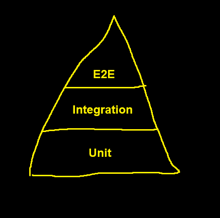
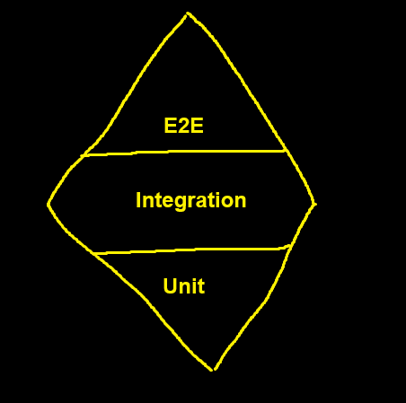
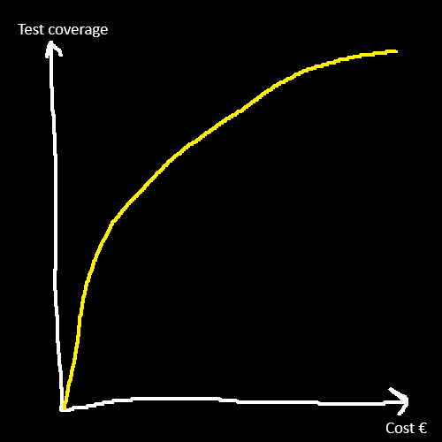

```{mermaid}
mindmap
  root((Quality assurance))
    (Testing)
      Manual testing
      Automated testing
        Unit testing
        Integration testing
        E2E testing
        ...
    (Coding standards)
      Static analysis
      Linting rules
      Style guidelines
    (Code reviews)
      Pull requests
    (Other activities)
      ...
```

::: {.content-visible unless-format="revealjs"}
Testing is a part of the overall software quality assurance process. Testing is used to ensure that the developed software does what it is supposed to do by trying it out.

Software engineers usually do testing by developing automated tests. Automated tests take on many forms depending on the scope of what is being tested.

An automated test's scope can range from testing a single method by passing predefined inputs and expecting predefined outputs, to running a whole application, including dependencies like a database, and testing that the application behaves correctly when interacted with via UI.
:::

***

The most simple automated test is just a dedicated method that calls another method with predefined input, and asserts that the returned result is what was expected.

```csharp
public int AddNumber(int a, int b)
{
    return a + b;
}

public void Test_AddNumber()
{
    if (AddNumber(5, 9) == 14)
    {
        Console.WriteLine("Test passed");
        return;
    }

    Console.WriteLine("Test_AddNumber failed");
}
```

***

Usually the methods you are testing are going to have more functionality and they will have to be tested against several cases:

```csharp
public double PerformMath(string expression)
{
    var parts = expression.Split(' ');
    var a = double.Parse(parts[0]);
    var b = double.Parse(parts[2]);

    switch (parts[1])
    {
        case "+":
            return a + b;
        case "-":
            return a - b;
        case "*":
            return a * b;
        case "/":
            return a / b;
        default:
            throw new ArgumentException("Invalid operator");
    }
}
```

***

Test methods:

```csharp
public void PerformMath_Addition_Works()
{
    var result = PerformMath("2 + 3");

    if (result != 5)
    {
        throw new Exception("Addition failed");
    }

    Console.WriteLine("Addition works");
}

public void PerformMath_Subtraction_Works()
{
    var result = PerformMath("2 - 3");

    if (result != -1)
    {
        throw new Exception("Subtraction failed");
    }

    Console.WriteLine("Subtraction works");
}
```

## What the automated tests should be like

Good automated tests are:

- Fast to execute.
- Predictable, meaning that there are no variations between runs.
- Easy to understand.

::: {.content-visible unless-format="revealjs"}
### Fast to run tests

Tests should run relatively fast. The longer the tests are going to run, the less frequently engineers are going to run them. For a medium sized project ~1min to run the tests is reasonable. If the tests were to run longer, for let's say 10 minutes, then it is almost guaranteed that engineers would run them very rarely, maybe once before the pull request.

The less frequently the tests are run, the less obvious benefit they bring, so the less intrinsic motivation engineers have to maintain and expand them.

Same logic applies to launching the tests. Tests should be launched with a single command. No additional commands, no additional service startups or environment preparations should be needed. The more setup tests require, the less likely they are going to be run because of the friction.

However there are some possible trade-offs when longer running tests might be tolerable, if they thoroughly test a large project or many smaller services.
:::

### Test predictability

Tests must be predictable between runs. This means that if the code under testing was not changed and the test itself was not changed, then the outcome of the test must always be the same, regardless of how many times or when it was run.

Tests that are not predictable between runs are called *flaky*.

::: {.content-visible unless-format="revealjs"}
Tests usually become flaky if they are using some shared state or relying on some uncontrolled, global, variables.

Examples of shared state include using a live database, a shared sqlite database file or a shared real implementation of some API. This means that the tests might influence each other's data and the subsequent tests can run against the data leftovers of the previous test.

Examples of global variables could be `DateTime.UtcNow` or similar date constructs. They are not controllable by the test, but are rather provided by the runtime. If the test assumes that some date is always going to be a future date and asserts it against some predefined date, eventually the future will arrive, the date will become a past date and the test will begin to fail.

The demo game awards double experience on weekends. The test below uses the real clock, so it passes on weekdays and fails on weekends:
:::

***

```{.csharp include="07-testing/WordGame.UnitTests/BrittleTests.cs" region="brittle"}
```

***

```{.csharp include="07-testing/WordGame.Api/Games.cs" region="experience"}
```

::: {.content-visible unless-format="revealjs"}
The fix is to make the clock controllable. Since .NET 8 the clock is abstracted as `TimeProvider`: the application uses `TimeProvider.System`, and tests use `FakeTimeProvider` (from the `Microsoft.Extensions.TimeProvider.Testing` package), which can be set to any date and moved forward instantly.
:::

***

```{.csharp include="07-testing/WordGame.UnitTests/GameServiceTests.cs" region="time"}
```

### Measuring test coverage

Test coverage percentage is used to find out how much of the code was "touched" by the tests during the test execution.

::: {.content-visible unless-format="revealjs"}
Coverage is calculated based on data collected while tests run. Line coverage measures the percentage of lines executed, and branch coverage checks if all paths in conditional statements are tested. These results are combined into a total percentage to show how much of the code tests cover.

In .NET, test coverage can be collected with the `Microsoft.Testing.Extensions.CodeCoverage` package (or Coverlet) and turned into a readable report with ReportGenerator, which shows the percentage of covered code and highlights tested and untested lines.

Some parts of the code should be excluded from coverage calculation. For example, generated code, third-party libraries, trivial code like simple getters and setters, and code related to debugging or logging. Without those parts, test coverage becomes more meaningful.

Test coverage percentage is not a very reliable metric for software quality. High coverage shows that the code runs during tests but doesn't prove that behavior is tested correctly. However, it is quick to implement and can be useful when combined with practices like code reviews.
:::

***

Lines covered by the tests in the previous example are prefixed with `+`.

```csharp
public double PerformMath(string expression)
{
+    var parts = expression.Split(' ');
+    var a = double.Parse(parts[0]);
+    var b = double.Parse(parts[2]);

+   switch (parts[1])
    {
+       case "+":
+            return a + b;
+       case "-":
+            return a - b;
        case "*":
            return a * b;
        case "/":
            return a / b;
        default:
            throw new ArgumentException("Invalid operator");
    }
}
```

In this example we could argue that 8 out of 14 LOC were covered by tests in the previous example so the total coverage is 8/14 ~= 57%.

## Why automated tests?

```{mermaid}
mindmap
  root(Automated testing)
    Goals of the automated testing
      Increased code quality
      Increased trust in the application
      Increased development velocity
```

::: {.content-visible unless-format="revealjs"}
Automated testing is supposed to help quickly, repeatedly and reliably determine if the code is functioning as expected. This in turn should help to increase the development velocity over time. Even if it does not look worthwhile to write tests at the beginning, because writing the tests themselves takes time, it is largely accepted that writing them pays off over a sufficiently long time.

The term "*sufficiently long time*" might be a bit ambiguous, so to put more concreteness into it: if you are guaranteed that some script you are writing is only going to be run once and only by you, then it might not be worthwhile to write automated tests as testing manually might indeed be faster. However if it is some project that you will be working on for a month, it is most likely already worthwhile to write some automated tests for it.
:::

::: {.content-visible unless-format="revealjs"}
Automated tests should tell you:

1. Is the code being tested working as expected?
2. If it is not working, then point you in the direction of problems.

The 1st point is obvious, while the 2nd point has much more to it than it might appear at first. Firstly the failing test should indicate what part of code is not working so you would know what you should investigate. This can be done via test naming, custom failure messages or combination of both. Usually it is easier to do this via test names.

Secondly, even if by the failing test name you know the use case that is failing, it would still be nice if the test could point you even more. This can be achieved via very clean test method code. The test code must be very legible. If the test code is very clear, then it should be very easy to trace how the assertion value that failed was acquired. Knowing the exact sequence of how the failure was produced should help you find the source of the problem.
:::

## Types of tests

```{mermaid}
mindmap
  root((Quality assurance))
    (Automated testing)
      Unit testing
      Integration testing
      E2E testing
      ...
```

::: {.content-visible unless-format="revealjs"}
### Unit tests

Unit tests are testing a single unit. The definition of unit can vary a lot, it can range from a single method, to the whole assembly.

Whatever the size of unit is decided to be, such tests, by definition, need to test that unit in isolation. Testing in isolation means that the dependencies of that unit which are slow or not deterministic are substituted with test doubles, and only the logic of that unit is tested.

The upside of this is that the tests allow to isolate the source of the problem easier, because an exact failing unit is known. However, the downside is that this warrants many more tests to cover all of the needed functionality, because these tests end up being small in their scope.
:::

::: {.content-visible unless-format="revealjs"}
### Integration tests

Integration tests test several units at once. You could say that integration tests test how well the units integrate with each other.

In practice this means that an integration test can test several modules at once, or test an application together with a database or with some other dependency.

However it is still crucial that the dependencies used would work deterministically, which means that testing with some development or production database is not the best idea. Running a special containerized instance of the database in such case would be a better solution.

In ASP.NET integration tests can be done by using `WebApplicationFactory`, which starts the application in memory and allows to override its services and configuration for the tests.
:::

::: {.content-visible unless-format="revealjs"}
### E2E tests

E2E stands for end-to-end. E2E tests test the whole application by running a full production-like environment and then interacting with the application via the UI.

The upside of such tests is that they reflect the way users will be using the application the best. In the end it doesn't matter if the `Calculator` class is implemented perfectly, if the button that is supposed to show the result does not work.

Another upside is that a single test can test multiple layers and use cases of the application, so a relatively small amount of such tests produces large coverage.

The downside of E2E tests is that they tend to be brittle - they break on changes unrelated to the tested behavior. For example changing the button label might make such tests fail. Another downside is that such tests are not very specific in pointing engineers to the root cause of what is causing the test to fail. They can tell you that something is not working, but not exactly what.
:::

### Alternative categorization of automated tests

```{mermaid}
mindmap
  root(Quality assurance)
    Automated testing
      Small tests
      Medium tests
      Large tests
```

::: {.content-visible unless-format="revealjs"}
Google categorizes tests by the resources they need rather than by what they test. Small tests run in a single process without any I/O (no disk, network or sleeping). Medium tests run on a single machine and can use the disk, local databases or localhost network. Large tests can use anything, including multiple machines and real external services. The size predicts how fast and how flaky a test will be better than the unit/integration/E2E name does.
:::

## Test doubles

```{mermaid}
mindmap
  root((Test doubles))
    [**Fakes**

        Working, simplified implementation
    ]
    [**Stubs**

        Return hard coded values
    ]
    [**Mocks**

        Verify how they were called
    ]
```

::: {.content-visible unless-format="revealjs"}
In order to isolate the code under test from irrelevant dependencies, test doubles can be used. Test doubles provide substitute implementations that allow the code under test to work but be more deterministic, or to force the expected scenarios or behavior.
:::

::: {.content-visible unless-format="revealjs"}
### Fakes

Fakes are implementations that are compatible with the real implementations, but use a simpler approach that is easier to manage when testing. An example would be a repository, which in real cases would be using a database or a file for persistence, substituted with a fake implementation that keeps everything in memory.

Such a fake implementation could not be used for real world scenarios, but depending on what is being tested and the fidelity of the fake implementation, it could be sufficient to test the desired use cases.
:::

***
#### Example of a Fake

```{.csharp include="07-testing/WordGame.UnitTests/FakeUserRepository.cs" region="fake"}
```

::: {.content-visible unless-format="revealjs"}
### Stubs

Stubs provide predefined "stubbed" implementations for dependencies. For example with the same repository, the stubbed repository could simply do nothing in the save method, and return a single hardcoded value when trying to get records.

In the demo, a stub replaces the random word picker, so that the tests know which words were picked and what the correct translations are.
:::

***
#### Example of a Stub

```{.csharp include="07-testing/WordGame.Testing/FixedWordPicker.cs"}
```

::: {.content-visible unless-format="revealjs"}
### Mocks

Mocks are set up to verify how they were used, such as that the `AddOrUpdate` method was called exactly once. This should be done with caution, as it easily leads to testing the way the class was implemented and not what it does.

Mocks (and stubs) are usually generated by libraries like `NSubstitute` or `Moq`, instead of being written by hand.
:::

***
#### Example of a Mock

```{.csharp include="07-testing/WordGame.UnitTests/UserServiceTests.cs" region="mock"}
```

## Testing pyramid



::: {.content-visible unless-format="revealjs"}
Testing pyramid is an example model for how amounts of different test types should be distributed.

The basis should be the unit tests, which should make up the majority of all tests. Rationale being that they are quick to write and run, and point directly at the problem when they fail.

Middle part should be integration tests.

And the smallest part should be the E2E tests.
:::

### Testing diamond



::: {.content-visible unless-format="revealjs"}
Testing diamond is an alternative model to testing pyramid.

Testing diamond suggests that integration tests should make up the majority of all tests.

Rationale in this case is that while they might be more complicated to write than unit tests, they also cover a larger surface area. In this model, one would argue that integration tests provide "better certainty" per "time invested".
:::

## Tests cannot ensure 100% quality



::: {.content-visible unless-format="revealjs"}
Tests can only ensure that what was tested works. It is increasingly difficult to cover 100% of the application in tests. This difficulty makes it economically impractical to strive for such coverage in most cases.
:::

::: {.content-visible unless-format="revealjs"}
There is always going to be some additional odd argument pair that was not tested. Just because the `"2 + 3"` argument worked in the last example, you cannot be 100% guaranteed that `"2 + 4"` will work.

However you can decide to be confident that if `"2 + 4"`, `"4 + 4"`, and `"4 + 3"` work, then maybe all other addition operations are going to work as well.

The more tests you write and more cases you cover - the more you can be certain that all possible cases work as well. However each test requires investment to write and maintain. You need to decide when you are confident enough with the existing tests and it is no longer worth the price to introduce more tests.
:::

## Frameworks

```{mermaid}
mindmap
  root((Testing frameworks))
    Python
      PyTest
      Unittest
    JavaScript
      Jest
      Vitest
      Playwright
    Java
      JUnit
      TestNG
      Mockito
    C#
      xUnit
      NUnit
      MSTest
```

::: {.content-visible unless-format="revealjs"}
Frameworks are used to discover and run tests defined in a certain assembly. After the test run finishes, the framework provides the statistics about the test run. However in order for a test framework to work, you have to write tests in the manner in which the testing framework expects.

The .NET CLI comes with `MSTest`, `NUnit` and `xUnit` testing project templates. This lecture focuses on `xUnit`, however other options are solid choices as well, and will most likely suit all your needs.
:::

::: {.content-visible unless-format="revealjs"}
### xUnit

#### Creating testing project

`dotnet new install xunit.v3.templates` followed by `dotnet new xunit3` will create a new testing project that uses xUnit v3.

#### Defining test case

`[Fact]` attribute denotes the method as a test method. Such a method tests a single condition.
:::

***
```{.csharp include="07-testing/WordGame.UnitTests/GameServiceTests.cs" region="correct-translations"}
```

::: {.content-visible unless-format="revealjs"}
#### Multiple test cases with single method

`[Theory]` attribute can be used to run the same test against multiple inputs. In this case the test method must also accept arguments, and these arguments are passed using `[InlineData]` or a similar attribute.
:::

***

```{.csharp include="07-testing/WordGame.UnitTests/GameServiceTests.cs" region="theory"}
```

::: {.content-visible unless-format="revealjs"}
In this example this one method definition creates 3 different test cases. Arguments passed via `[InlineData]` must match those that the theory method accepts.
:::

## Test behavior, not implementation

Test how the class behaves through its public interface. Not how it uses its dependencies or how it manages its internals.

Good:

```csharp
public void Test_List_CountsCorrectly() {
    var list = new List<int>();
    list.Add(123);

    Assert.Equal(1, list.Count);
}
```

Bad:

```csharp
public void Test_List_CountsCorrectly() {
    var list = new List<int>();
    list.Add(123);

    var size = GetFieldViaReflection<int>(list, "_size");
    Assert.Equal(1, size);
}
```

***

For a more elaborate example - consider the following class, which can save a record to the database using `Entity Framework` and also select from the database using it as well:

```csharp
public class StudentRepository
{
    private readonly IDbContext _dbContext;

    public StudentRepository(IDbContext dbContext)
    {
        _dbContext = dbContext;
    }

    public async Task Save(Student student)
    {
        _dbContext.Students.Add(student);
        await _dbContext.SaveChangesAsync();
    }

    public List<Student> GetAll()
    {
        return _dbContext.Students.ToList();
    }
}
```

***

**Bad example** where the underlying state is tested:

```csharp
[Fact]
public async Task Save_PersistsStudent()
{
    var fakeDbContext = CreateFakeDbContext();
    var studentRepository = new StudentRepository(fakeDbContext);

    var id = Guid.NewGuid();
    await studentRepository.Save(new Student { Id = id });

    Assert.True(fakeDbContext.Students.Any(s => s.Id == id));
}
```

::: {.content-visible unless-format="revealjs"}
The example above does white-box testing and it tests the way how the `StudentRepository` class is implemented rather than what it does. If the underlying implementation of `StudentRepository` class was changed to use some other ORM, then this test would break, although from the user's perspective the behavior would remain the same.
:::

***

**Better example** of how to test such case:

```csharp
[Fact]
public async Task Save_PersistsStudent()
{
    var fakeDbContext = CreateFakeDbContext();
    var studentRepository = new StudentRepository(fakeDbContext);

    var id = Guid.NewGuid();
    await studentRepository.Save(new Student { Id = id });

    var students = studentRepository.GetAll();

    Assert.True(students.Any(s => s.Id == id));
}
```

::: {.content-visible unless-format="revealjs"}
In this case the test asserts against the output of the public interface of the class. It tests the behavior that after saving, the method that returns all students will return the newly saved student as well. This is a black-box testing approach, where you ignore the implementation details and only test against the public interface of the class.

When tested like this, it allows for the implementation details of the class to change, without needing to update the tests.
:::

::: {.content-visible unless-format="revealjs"}
## Assertions

Assertions are used to ensure that the code under test performed what was expected of it. Testing libraries provide various assertion methods that can be used to verify states of the objects. If the assertion fails, then the assertion method usually throws an exception (typically specific to that testing framework).

It is considered a good practice to assert on the public contracts of classes and not on their internal implementations.
:::

## Test method structure

Test methods tend to follow a certain structure within the test.

Most common structure is like this:

1. Arrange the classes, data and dependencies for the test.
2. Act - execute the methods under testing.
3. Assert that the results are what was expected.

Some guidelines suggest that these blocks should be followed within the methods as much as possible.

## Test naming conventions

There are multiple naming conventions to choose from, and it is also possible not to have one at all and still have sensible test names.

However, one of the more popular conventions is to use 3 part name identifiers:

1. Name of the method being tested.
2. Scenario which is being tested.
3. Expected outcome.

`public void RegisterUser_EmailIsAlreadyTaken_ThrowsAnException()`.

## Demo: word game

::: {.content-visible unless-format="revealjs"}
The rest of the lecture is a demo of a small application with all three types of tests. The code is in the [`07-testing`](https://github.com/smagurauskas/software-engineering/tree/main/07-testing) folder, and its README describes how to run it.

- The player enters their email and starts a game.
- The game gives 3 English words, which the player has to translate to German.
- If all words are translated correctly within 5 minutes, the player is awarded experience: 10 per word, doubled on weekends.
- The player can see their total experience.

Authorization is skipped and the player is identified just by the email address.
:::

```{mermaid}
graph LR
    Web[React app] -->|HTTP| Api[ASP.NET API]
    Api --> GameService
    GameService --> UserService
    GameService --> IWordPicker
    GameService --> IGameStore
    GameService --> TimeProvider
    UserService --> IUserRepository
    IUserRepository --> File[(users.json)]
```

***

Everything that tests cannot control is behind an abstraction registered in the DI container:

```{.csharp include="07-testing/WordGame.Api/Program.cs" region="services"}
```

::: {.content-visible unless-format="revealjs"}
- `TimeProvider` - the clock, so tests can pick the date and move time forward.
- `IWordPicker` - randomness, so tests know which words were picked.
- `IUserRepository` - the users file, so tests can use a fake or a temporary file.
- `IGameStore` - the active games. Its in-memory implementation keeps state in an instance field (not a `static` one), so every test that creates its own store starts clean.
:::

***

The tested logic:

```{.csharp include="07-testing/WordGame.Api/Games.cs" region="complete-game"}
```

### Unit tests

::: {.content-visible unless-format="revealjs"}
The unit tests test `GameService` directly, without HTTP or the file system. The "unit" here is `GameService` together with `UserService` and `InMemoryGameStore`, because they are fast and deterministic - replacing them with doubles would only make the tests more coupled to the implementation. Only the file, randomness and the clock are replaced.
:::

```{.csharp include="07-testing/WordGame.UnitTests/GameServiceTests.cs" region="setup"}
```

***

```{.csharp include="07-testing/WordGame.UnitTests/GameServiceTests.cs" region="correct-translations"}
```

***

▶ Run the unit tests:

```bash
dotnet test --project WordGame.UnitTests
```

### Integration tests

::: {.content-visible unless-format="revealjs"}
The integration tests start the real application from `Program.cs` in memory with `WebApplicationFactory` (from the `Microsoft.AspNetCore.Mvc.Testing` package) and talk to it over HTTP. They test what the unit tests cannot: routing, JSON serialization, DI registrations and the real file repository.

The factory is shared with the E2E tests, so both test the application configured the same way. Since .NET 10 the `Program` class generated for top-level statements is public, so `WebApplicationFactory<Program>` works without adding `public partial class Program { }` to `Program.cs`.
:::

```{.csharp include="07-testing/WordGame.Testing/WordGameFactory.cs" region="factory"}
```

***

```{.csharp include="07-testing/WordGame.IntegrationTests/GamesApiTests.cs" region="setup"}
```

***

```{.csharp include="07-testing/WordGame.IntegrationTests/GamesApiTests.cs" region="full-flow"}
```

***

Integration with the file system:

```{.csharp include="07-testing/WordGame.IntegrationTests/JsonFileUserRepositoryTests.cs" region="file"}
```

***

▶ Run the integration tests:

```bash
dotnet test --project WordGame.IntegrationTests
```

### E2E tests

::: {.content-visible unless-format="revealjs"}
The E2E tests start the same application on a real port, open the React app in a browser with Playwright and play the game the way a player would: by filling in inputs and clicking buttons. Elements are found by their accessible label and role (`GetByLabel`, `GetByRole`), the same way a screen reader user would find them, which makes the tests less brittle than CSS selectors.

The frontend has to be built first (`npm run build` in `WordGame.Web`), because the API serves the built files.
:::

```{.csharp include="07-testing/WordGame.E2ETests/BrowserFixture.cs" region="fixture"}
```

***

```{.csharp include="07-testing/WordGame.E2ETests/PlayingTheGameTests.cs" region="setup"}
```

***

```{.csharp include="07-testing/WordGame.E2ETests/PlayingTheGameTests.cs" region="correct"}
```

***

▶ Run the E2E tests with a visible browser:

```bash
HEADED=1 dotnet test --project WordGame.E2ETests
```

### When a test fails

▶ Break the game: in `GameService.CompleteGame` change `!AreCorrect(...)` to `AreCorrect(...)` and run each test project again.

| Test type   | Failure message                                                         | Time |
|-------------|-------------------------------------------------------------------------|------|
| Unit        | `GameServiceTests.CompleteGame_CorrectTranslations_AwardsExperience`: `Assert.True() Failure` | ~2s  |
| Integration | `GamesApiTests.CompleteGame_CorrectTranslations_ExperienceIsSavedForUser` | ~2s  |
| E2E         | `Locator expected to have text 'Correct! +30 XP'` (after a 5s timeout)  | ~10s |

::: {.content-visible unless-format="revealjs"}
All three test types detect the problem, but with very different precision. The unit test names the exact method and scenario. The integration test points to the HTTP endpoint. The E2E test only says that a text did not appear on the page - the problem could be anywhere from the button to the file system. The Playwright trace (opened at <https://trace.playwright.dev>) helps by showing screenshots and network requests for every step.
:::

### Coverage

▶ Collect coverage of the unit tests and generate an HTML report:

```bash
dotnet test --project WordGame.UnitTests --coverage --coverage-output-format cobertura --coverage-output coverage.cobertura.xml
```

```bash
dotnet reportgenerator -reports:TestResults/coverage.cobertura.xml -targetdir:coverage-report -assemblyfilters:+WordGame.Api
```

::: {.content-visible unless-format="revealjs"}
The unit tests cover `GameService` completely, but not `Program.cs`, `JsonFileUserRepository` or `RandomWordPicker` - those are covered only by the integration tests, or not at all. `GameService` being 100% covered also does not mean every behavior is tested: coverage only shows that lines ran, not that their results were checked.
:::

# Additional reading

- https://madeintandem.com/blog/five-factor-testing/ - Practical reasons to write tests.
- https://martinfowler.com/articles/mocksArentStubs.html - Mocks aren't stubs.
- https://testing.googleblog.com/2010/12/test-sizes.html - Test sizes at Google.
