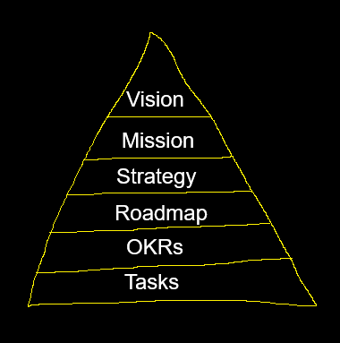

As taken from SWEBOK:

>Software construction refers to the detailed creation and maintenance of software through coding, verification, unit testing, integration testing and debugging.

***

```{mermaid}
flowchart LR
    Plan[Figure out what to do]
    Construct[Software Construction]
    Users[Users use the software]

    Plan -->|Defines requirements| Construct
    Construct -->|Ships product| Users
    Users -->|Get feedback| Plan
```

::: {.content-visible unless-format="revealjs"}
This notebook explores the software construction in general. Software construction process is based on how SWEBOK describes it. However, because software construction doesn't happen in a vacuum, adjacent business areas and how they relate to software engineering will be explored as well.

In places where it is relevant, common industry practices are inserted. It is not meant to describe the definitive or best way how the software can be constructed, but rather just to introduce some of the most common practices and rationale behind time.
:::

## SWEBOK

**SWEBOK** stands for **S**oft**w**are **E**ngineering **B**ody **o** **K**nowledge. It refers to all common knowledge that exists about the software engineering discipline.

"*SWEBOK Guide*" is a book that provides an organized overview of that knowledge

## Software development process

In a simplified view the software development process can be broken down into 3 major steps:

```{mermaid}
flowchart LR
    requirements(Define the requirements)
    development(Develop the software)
    maintenance(Maintain the software)

    requirements --> development
    development --> maintenance
```

## Defining the requirements

Requirements expresses the needs and constraints for software product that contributes to the solution of a real world problem.

The software product or project is supposed to introduce some change on the real world. The change might be allowing people to do something they wanted, but could not do before; allowing to perform some desireable task faster, allowing to perform something more pleasurably; allowing to perform something more cost efficiently etc.

### Developing the software

Developing the software is the process of transforming requirements for software into a working product. This process is area is very wide. It can be further broken down into smaller areas, like the software architecture, software design, software development and so on.

### Maintaining the software

Maintaining the software is (generally speaking) what is done to the software after it is initially launched. 

Business and the world around software keeps constantly changing. The software that was perfectly serving user's needs one day, might need to be extended with new functionality to serve the users tomorrow.

::: {.content-visible unless-format="revealjs"}
Even if the needs of users do not change, the software degrades over time and it needs to be regularly revisited to ensure that it keeps serving the requirements that were initially set to it. For example the requirement for the software product could be that it must strive for the upmost security standard, so no security vulnerabilities are acceptable. Even if the software has no known security vulnerabilities today, a new vulnerability in one of the packages used could be tomorrow, and so the product would not be of satisfactory quality, and would have to be updated to get back in line the initial requirements.
:::

## Teams

Software delivery is a team process.

Teams typically consist of several roles with different responsibilities between them.


```{mermaid}
flowchart LR
    PM[Product Manager]
    EM[Engineering Manager]
    SE[Software Engineer]
    QA[Quality Assurance Engineer]
    Users([Users])
    Dev([Development / Coding])

    PM -->|Defines requirements & priorities| EM
    EM -->|Assigns construction tasks| SE
    EM -->|Assigns construction tasks| QA
    SE -->|Performs coding & testing| Dev
    Dev -->|Validates quality| QA
    QA -->|Reports issues| SE
    SE -->|Ships release| Users
    Users -->|Provides feedback| PM
```

### Software Engineer

Develops the actual software. 

Job usually involves not only developing the software, but also making design decisions, making configurations (DevOps), or helping other roles with tasks like data exporting and so on.

The backbone and most important role in software development.

### Engineering Manager

Manages the team of engineers.

Makes sure the team spends the time on most important things and follows the required practices. 

Helps members to the team to grow in terms of their careers.

### Product Manager

Responsible for defining vision and strategy, and acting as a voice of a user.

In practice this means defining the product direction, expressing user requirements and acting as an overall expert of the product. Product Managers play a big role in prioritizing the product roadmap.

::: {.content-visible unless-format="revealjs"}
Not to be confused with Product Owner, which is a Scrum role. Due to the naming similarity these titles are sometimes used interchangeably, but the proper role should still be called *Product Manager*.
:::

### Quality Assurance Engineer

Ensures the quality of the software deliver.

This can be done via different means, which can involve manual or automatic testing. Other options can involve providing guidance to organization, promoting better quality practices etc.

## Business needs analysis

Business needs analysis relates to "figuring out what to do" in the diagram at the start.

It is something that would most likely be done the Product Managers in the modern software development teams.

***

Before creating requirements, you need to be figure out what problem you are solving. Without knowing having the problem (the goal), the requirements would be just an arbitrary list of tasks/things to accomplish.

Business needs analysis deals with identifying valuable problems to solve.

Business needs analysis has many techniques. However these techniques focus not on providing definitive answers on how to do the business, but on structuring the thinking process.

### Vision, Mission, Strategy



***

- Vision - what is the ideal situation you would like to live in?
- Mission - how will you help to achieve that?
- Strategy - how are you going to do that?
- Roadmap - what steps are you taking to implement the strategy?
- OKRs - how will you measure if you are succeeding?
- Tasks - daily activities to reach the goals

***

Vision (sometimes – mission) is the reason why the product exists.

- Disney: To make people happy.
- Ikea: To create a better everyday life for the many people.
- Google: to provide access to the world's information in one click.
- Microsoft: to help people and businesses throughout the world realize their full potential.

::: {.content-visible unless-format="revealjs"}
Various versions of such pyramid exists. The levels can be different, and the number of these levels can differ as well. However the shared theme is that at the top there is at the top are the most abstract level, and at the bottom the most concrete one.
:::

### MOST Analysis

```text
+-------------------------------+
|           Mission             |
| (Purpose of the organization) |
+-------------------------------+
|          Objectives           |
| (Key goals to achieve mission)|
+-------------------------------+
|           Strategy            |
|  (Approach to meet objectives)|
+-------------------------------+
|            Tactics            |
|  (Specific actions to execute)|
+-------------------------------+
```

### Business model canvas


### SWOT

```text
+-------------------------+-------------------------+
|        Strengths        |        Weaknesses       |
|-------------------------|-------------------------|
| - Internal capabilities | - Internal limitations  |
| - Positive attributes   | - Areas for improvement |
| - Competitive advantages| - Competitive           |
|                         |   disadvantages         |
+-------------------------+-------------------------+
|       Opportunities     |         Threats         |
|-------------------------|-------------------------|
| - External conditions   | - External risks        |
| - Market trends         | - Competition           |
| - Potential for growth  | - Market challenges     |
+-------------------------+-------------------------+
```

::: {.content-visible unless-format="revealjs"}
SWOT analysis can be used to guide decisions and strategy the product takes.
:::

### 5 Whys

```{mermaid}
flowchart TD
    A["Problem Statement"]
    A --> B["Why #1: First reason identified"]
    B --> C["Why #2: Reason for Why #1"]
    C --> D["Why #3: Reason for Why #2"]
    D --> E["Why #4: Reason for Why #3"]
    E --> F["Why #5: Root cause identified"]


```

::: {.content-visible unless-format="revealjs"}
Five whys (or 5 whys) is an iterative interrogative technique used to explore the cause-and-effect relationships underlying a particular problem.

The primary goal of the technique is to determine the root cause of a defect or problem by repeating the question "Why?". The idea is that if you ask 5 recursively 5 times, then you should arrive at the root cause. Of course the number 5 is arbitrary here, but the notion of recursively asking question "why?" until you arrive to the root causes is a widely used technique for unwrap complex problems.
:::

### Stakeholder management

Stakeholder: a member of "groups without whose support the organization would cease to exist".

Each stakeholder group has different stakes at company or product.

#### Examples of stakeholders

- Software Engineer - develops the actual software.
- Product Manager - sets direction of the product.
- End User - person that uses the product.
- Economic buyer - in B2C context a person that makes the decision to purchase the product.
- Customer Support/Success Specialist - needs to helps users to use the product successfully.
- Marketing Specialist - promotes the product to potential clients.
- Sales Representative - closes the deals with the clients.
- Legal - makes sure the product is legally compliant.
- Executive Sponsor - decides if the product idea worth pursuing.
- Investor - expects return on investment from the product.

::: {.content-visible unless-format="revealjs"}
From SWEBOK:

- Stakeholders should provide support, information, and feedback at all stages of the software life cycle process. 
- For example, during the early stages, it is critical to identify all stakeholders and discover how the product will affect them.
- So that sufficient definition of the stakeholder requirements can be properly and completely captured.
- It is vital to maintain open and productive communication with stakeholders for the duration of the software product’s lifetime.
:::

### SMART Goals

```text
+---------------+--------------------------------------+
|     SMART     |           Goal Criteria             |
+---------------+--------------------------------------+
|    Specific   | Clear and specific goal              |
+---------------+--------------------------------------+
|   Measurable  | Progress can be tracked and measured |
+---------------+--------------------------------------+
|   Achievable  | Realistic and attainable             |
+---------------+--------------------------------------+
|   Relevant    | Aligned with broader objectives      |
+---------------+--------------------------------------+
|   Time-Bound  | Has a defined timeline or deadline   |
+---------------+--------------------------------------+
```

### OKRs

OKR stands for **O**bjective and **K**ey **R**esults.

John Doerr introduced Google to OKR, has a formula for setting goals:

>I will ________ as measured by ____________.

Example of OKR:
>I will (Objective) as measured by (this set of Key Results).

#### OKR example

Objective: Create an Awesome Customer Experience.

Key Results:
- Improve Net Promoter Score from X to Y.
- Increase Repurchase Rate from X to Y.
- Maintain Customer Acquisition cost under Y.

***

Objective: Delight our customers.

Key Results:
- Reduce revenue churn (cancellation) from X% to Y%.
- Increase Net Promoter Score from X to Y.
- Improve average weekly visits per active user from X to Y.
- Increase non-paid (organic) traffic to from X to Y.
- Improve engagement (users that complete a full profile) from X to Y.

***

Objective : Refactor our old user management module.

Key Results:
- Survey 5 external API users regarding issues with our authentication.
- Discuss the user management code usage with 5 engineers having used it in production.
- Rewrite and launch new version of our user management module.
- Rewrite the API user authentication for new version.

***

Objective: Improve our testing procedures.

Key Results:
- Implement test-driven development in 3 new development teams.
- Increase unit test coverage to 75% of code.
- Conduct a security assessment of our codebase using automated tools.
- Make sure satisfaction score of product management to the testing team is at least 7.5.
- Discover at least 100 bugs and open issues in old code not reviewed in 6 months.

### Requirements analysis

At its most basic, a software requirement is a property that must be exhibited in order to solve some problem in the real world.

Software requirements should be stated as clearly and as unambiguously as possible, and, where appropriate, quantitatively.

An essential property of all software requirements is that they be verifiable. Sometimes that might be difficult.

#### Functional requirements

>Functional requirements specify observable behaviors that the software is to provide — policies to be enforced and processes to be carried out. Example policies in banking software might be “an account shall always have at least one customer as its owner,” and “the balance of an account shall never be negative.”

#### Non-functional requirements

>Nonfunctional requirements in some way constrain the technologies to be used in the implementation: What computing platform(s)? What database engine(s)? How accurate do results need to be? How quickly must results be presented? How many records of a certain type need to be stored?

### Recap

- Business needs analysis deals with figuring out what to do.
- In practice these activities relate most to what PMs do, but not necessarily.
- To define requirements you need to have broader vision of what you want to achieve.
- You need some kind of measurement process to know if you getting closer to your goal.
- It is easier to define requirements, once you have a good mental model of you vision and goals.

## Software construction

>Software construction refers to the detailed creation and maintenance of software through coding, verification, unit testing, integration testing and debugging

### Fundamental concepts

Software construction has 5 fundamental concepts:

1. Minimizing complexity.
1. Anticipating change.
1. Constructing for verification.
1. Reusing assets.
1. Applying standards.

These concepts are heavily intertwined and influence each other.

#### Minimizing complexity

People are limited by the amount of things they can maintain in the working memory at any given time.

Complexity is reduced by writing code easy to read, rather than writing smart code.

***

Very good repository explaining the most important points about the cognitive load in software engineering: https://github.com/zakirullin/cognitive-load.

***

Metrics that measure complexity:

- McCabe's cyclomatic complexity metric
- Halstead complexity measures metric
- Chidamber & Kemerer object-oriented metrics suite

#### Anticipating change

It is accepted that software will have to change overtime. Code should be written in such a way that it should be possible to change to adapt to future needs.

Problem is:
- If the code is not properly design to allow making changes, then the development cost might increase unsustainably over time.
- If the code is too optimized for change, then it will likely too many abstractions and indirection.

Goal is too properly identify what is most likely to change and optimize only these areas to the needed degree.

#### Constructing for verification

>Constructing for verification builds software in such a way that faults can be readily found by
the software engineers writing the software as well as by the testers and users during independent testing and operational activities.

>Specific techniques that support constructing for verification include following coding standards to support code reviews and unit testing, organizing code to support automated testing, restricting the use of complex or difficult-to-understand language structures, and recording software behaviors with logs.

#### Reusing assets

Modern software development is absolutely based on reusing assets. Almost no software is being written without any frameworks or libraries.

Libraries can be created to promote asset reuse within the same or different projects.

Main problem is to correctly identify what is worth reusing and what is worth reusing and what is not.

#### Applying standards

It is generally accepted that applying standards helps to increase quality and efficiency.

Examples where standards can be applied:
- Programming languages used.
- Standardizing formats and protocols used (i.e. every project must expose OpenAPI specification).
- Code standards (style).
- Solving common problems, i.e. how exceptions should be handled.
- What tools are used by developers (i.e. IDEs).

### Practical considerations

Examples of things software engineers need to consider during the software development process:

- Choosing a language,
- Coding conventions,
- What to reuse,
- What to make reusable.

#### Choosing a language

What language to use for the job?

Criteria for consideration:
- What language are engineers on the team are familiar with?
- Does the performance (speed) of language matter?
- How big is the language's ecosystem?
- How easy it is hire engineers working with this language?
- And more...

#### Coding conventions

It is accepted that any unified code style is better than mix of styles. However there are questions with more nuances:

- How big the classes should be?
- How long the method should be?
- What should be the upper limit on the number of parameters a method can have?
- Should you have standardized library for solving specific use case (i.e. automappers)?
- Should there be a policy how the exceptions should be handled?
- And more...

#### Reuse in construction

When to reuse existing assets?

Pros of reusing:
- Readily solves the problem at hand (maybe).
- Provides standardization between projects or organizations (if using some shared libraries).
- If it is a common problem, then external library might be better maintained than what you could build yourself.

Potential problems of reusing:
- Is it worth to include whole library if only 1 method is needed?
- Is it better to use readily available implementation that is 90% perfects or to build your own?
- Potentially introducing security risks with external package.

#### Construction for reuse

Should the code being written should be made reusable?

Things to consider:
- Is this already a recurring problem?
- Can this implementation serve more than a single use case?

### Defensive programming

Defensive programming is a software development practice to always validate all the inputs. To do defensive programming means not to assume anywhere that the inputs are going to be always valid.

```csharp
public class BankAccount
{
    public decimal Balance { get; private set; }

    public void Withdraw(decimal amount)
    {
        if (amount <= 0) throw new ArgumentException("Withdrawal must be positive.");
        if (amount > Balance) throw new InvalidOperationException("Insufficient funds.");
        Balance -= amount;
    }
}
```

### Choosing deployment model

Microservices vs. Monolith.

Microservices:
- Complex.
- Introduces development overhead.
- Can help with scaling for more users or more teams.

Monolith:
- Easy to start with.
- Easy to understand, all the references can typically be navigable within the same project.
- Can be vertically scaled with cloud technologies quite well.
- Blast radius increases when more teams are onboarded.

## Maintenance and modification

Software maintenance in software engineering is the modification of a software product after delivery to correct faults, to improve performance or other attributes.

A common perception of maintenance is that it is bug-fixing, although ~80% of maintenance effort is used for non-corrective actions.

### Maintenance objectives

Maintenance is done in order to:
- correct faults,
- improve the design,
- implement enhancements,
- interface with other software,
- adapt programs so that different hardware, software, system features, and telecommunications facilities can be used,
- migrate legacy software,
- retire software.

### Maintainability

The ease with which a product can be maintained in order to:
- correct defects or their cause,
- repair or replace faulty or worn-out components without having to replace still working parts,
- prevent unexpected working conditions,
- maximize a product's useful life,
- maximize efficiency, reliability, and safety,
- meet new requirements,
- make future maintenance easier, or
- cope with a changed environment.

## Further reading

- https://berthub.eu/articles/posts/on-long-term-software-development/ - challenges faced during long term software project development.
- https://www.writethedocs.org/guide/ - writing software documentation.
