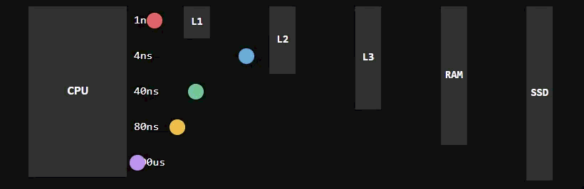

This notebook covers topics of performance and foundation of what to think about when you want to juice out extra bit performance.

In this notebook we focus on CPU bound tasks specifically.

Examples given are in C#, but the general ideas should be applicable to most languages.

### Agenda

Key topics covered in this notebook:
- Memory locality - how make best use of CPU cache
- Branch prediction - how to make best use of CPU pipeline
- SIMD - using more performant vectorized instructions

### Benchmark.NET

To optimize the performance we first need to be able to measure it. For this purpose we will be using the library [BenchmarkDotNet](https://github.com/dotnet/BenchmarkDotNet).

Quick link how to setup benchmarks: [getting started](https://benchmarkdotnet.org/articles/guides/getting-started.html).

### CPU intensity vs Data intensity

When talking about performance, the workloads can be roughly grouped into 2 categories:

- CPU intensive - workloads that are bound by the CPU performance, for example: doing a lot of calculations.
- Data intensive - workloads that are bound by the IO performance, for example: reading/writing to disk or network.

In this notebook we will be focusing on CPU intensive workloads, and how to optimize them.

## Memory allocations

A few facts when considering memory allocations in C#:

- C# uses ever increasing pointer (_bump pointer_) for heap allocations, and the memory is allocated in contiguous blocks. There is no significant performance overhead for heap allocations, but the memory can become very fragmented over time.
- As a rule of thumb, specifying collection size upfront will help with performance.
- Large object heap (LOH) is never compacted, unless explicitly requested.
- LOH allocations check for free blocks and allocate into them.
- Arrays are guaranteed to be contiguous in memory.

***

Review the following code examples to see how different types of memory allocations can affect performance:
1. [MemoryAllocations1.cs](15-performance/MemoryAllocations1.cs)
2. [MemoryAllocations2.cs](15-performance/MemoryAllocations2.cs)
3. [MemoryAllocations3.cs](15-performance/MemoryAllocations3.cs)

## Memory locality and CPU cache

When a value is read from memory, technically not only the exact value requested is read, but a range of values from memory which includes the requested value. The range is stored in CPU cache.

- The size of mentioned range is called *cache line*.
- Most common size of cache line is now *64 bytes*.

::: {.fragment}
For example:
- You are trying to read byte value at an offset *9000* (dec) from memory
- Cache line including bytes *9000 - 9063* will be actually read.
- If you want to read byte at an offset *9001*, then it is already in the cache.
:::

***

Source: https://planetscale.com/blog/caching

***

- L1 is faster than L2, which is faster than L3.
- Data in different cache levels is kept synchronized using *cache-coherence* protocols like MESI/MOESI.

***

There are 3 main types of caching:
1. Inclusive cache - L2 contains all data from L1, L3 contains all data from L2
2. Exclusive cache - L1, L2 and L3 will contain different data
3. Non-inclusive non-exclusive cache - L1, L2 and L3 may contain different data

Different CPU lines use different caching strategies, so the Intel vs AMD, and server vs consumer CPU may perform differently.

### Types of cache prefetchers

Prefetchers are hardware components that try to make sure that the data that you will need in the future is already in the cache.

Generally they can be classified into 2 types:

1. Spatial prefetchers - they prefetch the data that is close together. Can also prefetch data that is scattered by a pattern (strided prefetcher).
2. Temporal prefetchers - they prefetch data that follows a certain access pattern.

### Memory locality code examples

Although it is hard to account for everything with small examples, this one tries to sum the numbers from a collection when it is allocated in the stack and when it is allocated on the heap.

Take a look at [MemoryLocality1.cs](15-performance/MemoryLocality1.cs) example.

***

In the example "MemoryLocality2", it is assumed that array will always be allocated on the heap, but in the case of `struct`, the contained values should be placed adjacent in the heap, while that is not guaranteed with `class`.

Take a look a [MemoryLocality2.cs](15-performance/MemoryLocality2.cs) example.

***

Review the following examples:
1. [MemoryLocality3.cs](15-performance/MemoryLocality3.cs)
1. [MemoryLocality3_2.cs](15-performance/MemoryLocality3_2.cs)
2. [MemoryLocality4.cs](15-performance/MemoryLocality4.cs)
3. [MemoryLocality5.cs](15-performance/MemoryLocality5.cs)

### Virtual memory tables

Modern OS uses virtual memory tables. When OS enters user mode, it can assign virtual memory addresses to the process, and then translate them to physical memory addresses on the CPU level.

Typical page size is 4KB, which means that technically OS cannot assign less than 4KB of memory to a process. That's why not all out of bounds reads will result in SEGFAULT, but only those that are outside of the assigned page.

Prefetchers stop at physical page boundaries. If you virtual memory is fragmented, then you may have worse performance due to more cache misses. OS have instructions like huge pages to work around this issue.

## Instruction pipelining and branch prediction

- Each stage of pipeline is executed by a different part of the CPU core
- For instruction to be complete it needs to move through all the stages of the pipeline
- If only 1 instruction is executed at the time in pipelined CPU, then it means that some parts of CPU are idling
- By starting next instruction before waiting the previous one to complete, CPU utilization could be increased
- Next instruction is not always obvious (think `JMP IF`)

| Cycle | Fetch | Decode | Execute | Write Back |
|-------|-------|--------|---------|------------|
| 1 | I1 | - | - | - |
| 2 | I2 | I1 | - | - |
| 3 | I3 | I2 | I1 | - |
| 4 | I4 | I3 | I2 | I1 |
| 5 | I5 | I4 | I3 | I2 |
| 6 | I6 | I5 | I4 | I3 |
| 7 | - | I6 | I5 | I4 |
| 8 | - | - | I6 | I5 |
| 9 | - | - | - | I6 |

***

Consider that the CPU predictor incorrectly predicted next instruction. Now the pipeline needs to be flushed, and the correct instruction needs to be fetched, decoded, executed and written back. This is called a *branch misprediction*.

Assume that at cycle 7 the CPU predicted that next instruction will be I7, but it was not. The pipeline needs to be flushed, and the correct instruction needs to be fetched, decoded, executed and written back.

| Cycle | Fetch | Decode | Execute | Write Back |
|-------|-------|--------|---------|------------|
| 1 | I1 | - | - | - |
| 2 | I2 | I1 | - | - |
| 3 | I3 | I2 | I1 | - |
| 4 | I4 | I3 | I2 | I1 |
| 5 | I5 | I4 | I3 | I2 |
| 6 | I6 | I5 | I4 | I3 |
| 7 | I7 | - | - | - |
| 8 | I8 | I7 | - | - |
| 9 | - | I8 | I7 | - |
| 10 | - | - | I8 | I7 |
| 11 | - | - | - | I8 |

In this example CPU took 11 cycles to execute 8 instructions.

*This is grossly oversimplified*

***

Review the following code examples:
1. [BranchPrediction1.cs](15-performance/BranchPrediction1.cs)
2. [BranchPrediction2.cs](15-performance/BranchPrediction2.cs)

***

In some cases code can be rewritten so that it produces the same result, but doesn't have branching at all.

Consider original code was only counting even numbers in the example: [BranchPrediction3.cs](15-performance/BranchPrediction3.cs)

Then it can be rewritten to something like this: [BranchPrediction4.cs](15-performance/BranchPrediction4.cs)

## SIMD

SIMD stands for Single Instruction Multiple Data.

In a nutshell:

- Instructions that take more cycles to execute.
- They operate on multiple data points at the same time.

For example: instruction adds 8 pairs of numbers at the same time, but only takes 2 times more to execute than adding 1 pair of numbers.

***

There are several SIMD instruction sets (roughly chronologically):

- SSE/2 (Streaming SIMD Extensions) - 128-bit registers, operates on floating point and integer
- AVX (Advanced Vector Extensions) - 256-bit registers, operates on floating point and integer
- AVX-512 - 512-bit registers, operates on floating point and integer

***

See code examples:
1. [Simd1.cs](15-performance/Simd1.cs)
2. [Simd2.cs](15-performance/Simd2.cs)

## References and reading material

- https://www.cs.cornell.edu/courses/cs3110/2012sp/lectures/lec25-locality/lec25.html
- https://go.dev/blog/greenteagc
- https://mcyoung.xyz/2023/11/27/simd-base64/
- https://lemire.me/blog/2024/06/08/scan-html-faster-with-simd-instructions-chrome-edition/
